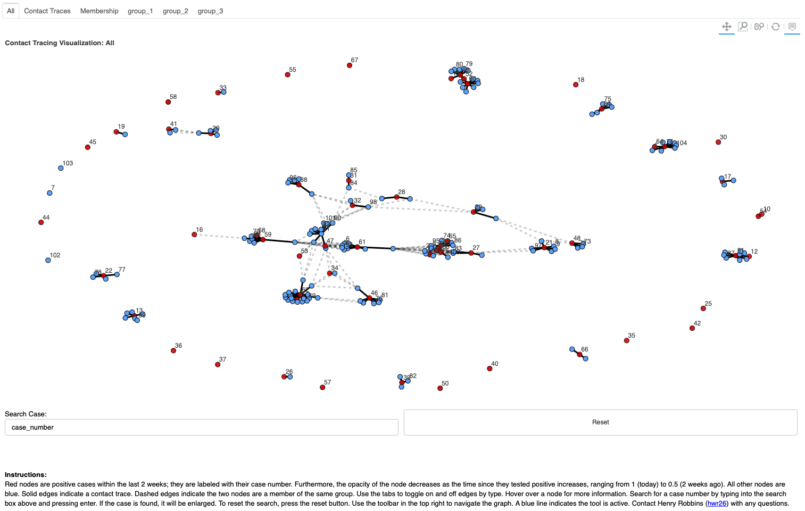

# 

[](https://circleci.com/gh/cornell-covid-modeling/cotat/tree/master)
[](https://cotat.henryrobbins.com/en/latest/?badge=latest)
[](https://codecov.io/gh/cornell-covid-modeling/cotat)

cotat is a visualization tool for the analysis of contact tracing data. Given
a dataframe of people (along with their attributes) and a dataframe of
known contacts among the individuals, cotat exports an interactive HTML
visualization of the network. Furthermore, certain columns of the people
dataframe can be labeled as "membership columns" which allows one to visualize
which people belong to the same groups (e.g. building, club, etc..) even if
a contact between those individuals has not been reported.

## Examples



## Installation

The quickest way to get started is with a pip install.

```
pip install cotat
```

## License

Licensed under the [MIT License](https://choosealicense.com/licenses/mit/)
